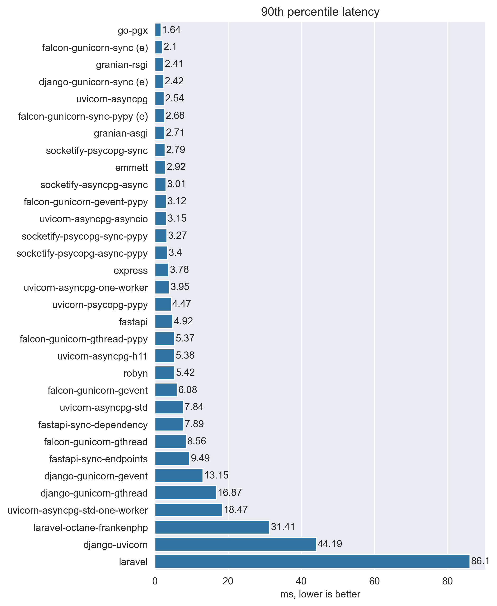
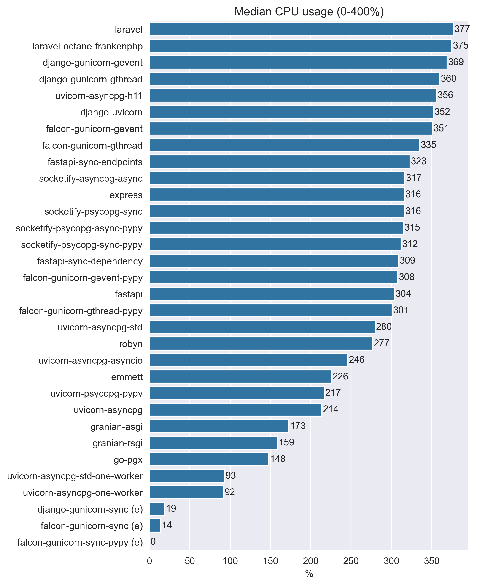

# My Web Frameworks Benchmarks Results

## Disclaimer

Just a simple benchmark to compare the overhead of some web frameworks.
Not representative of real world usage,
don't take it too seriously and always do your own benchmarks.

## Methodology

For benchmarking I used laptop with Intel Core i5-7300hq for running web frameworks and
MacBook Air M1 for running wrk.

Frameworks not limited by RAM or CPU, if framework can use multiple threads
I set it to use all available threads (4 in case of my laptop).

To collect cpu and memory usage I used `monitor.sh` script that just dumps docker stats to a file.

wrk was run with 8 threads, because it's the number of threads that my MacBook Air M1 has.
Connections number is 180, but i think that we need to switch to another method:

1. start from some small number of connections, like 20 or 50
2. increase number of connections by some step and watch cpu utilization on machine with web framework
3. if server responds with errors - stop increasing number of connections
4. when cpu utilization reaches 100% - stop increasing number of connections
5. as bonus we can continue increasing number of connections until server responds with errors.
    In this case we can see how many connections server can handle before it starts to respond with errors.

## Results

### plaintext

### json

