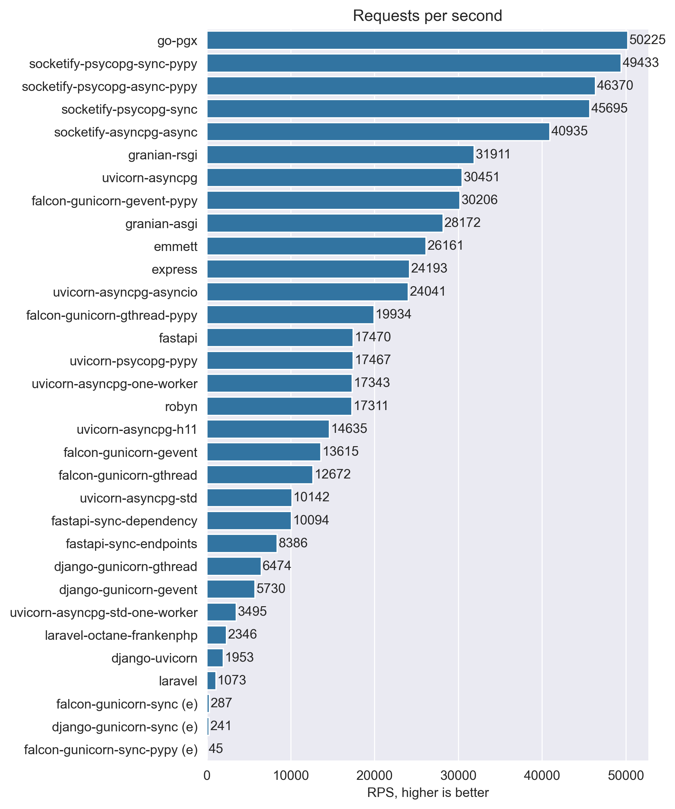
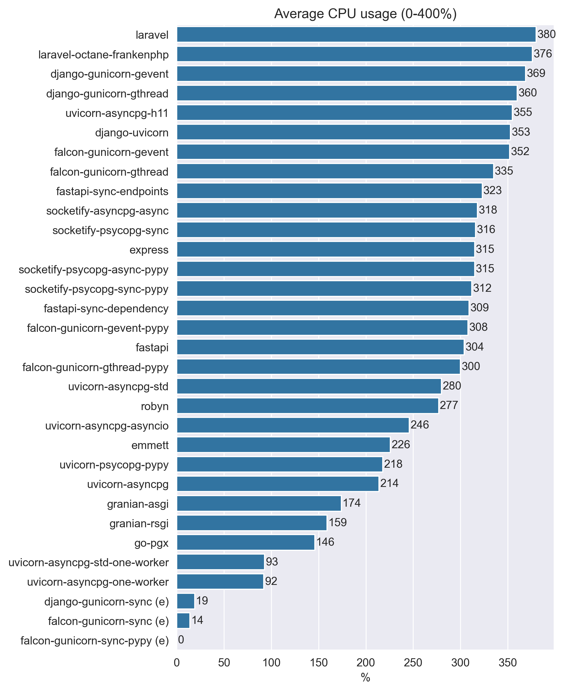
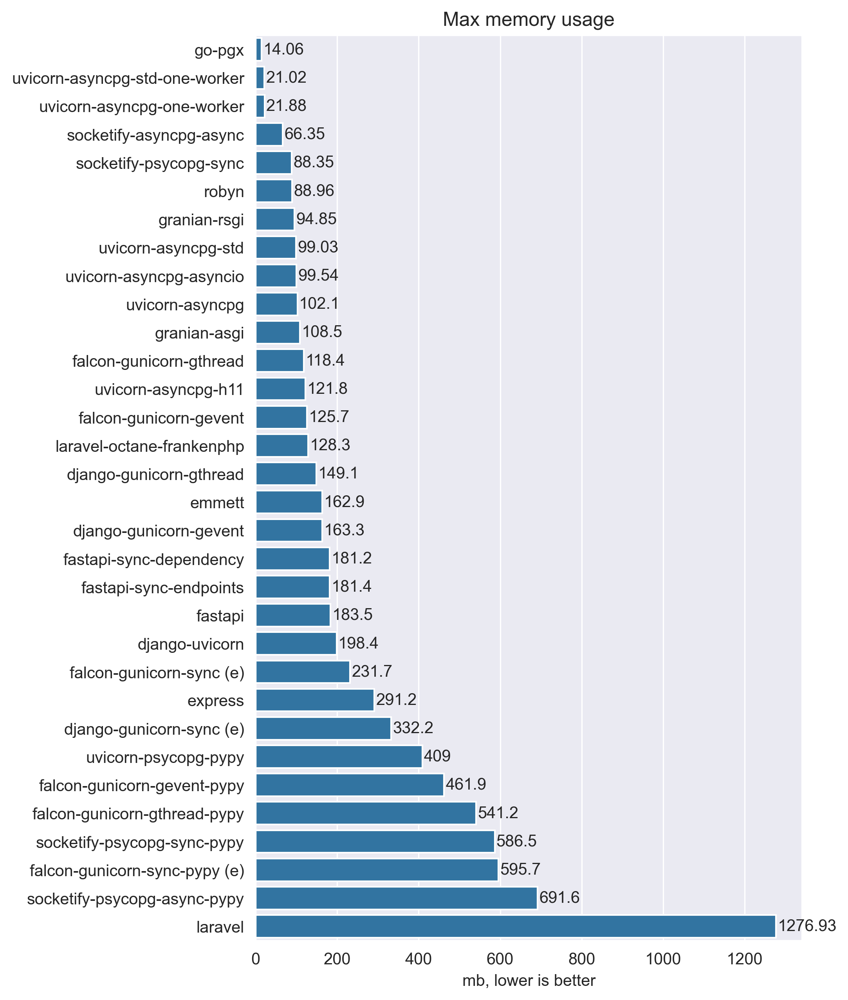
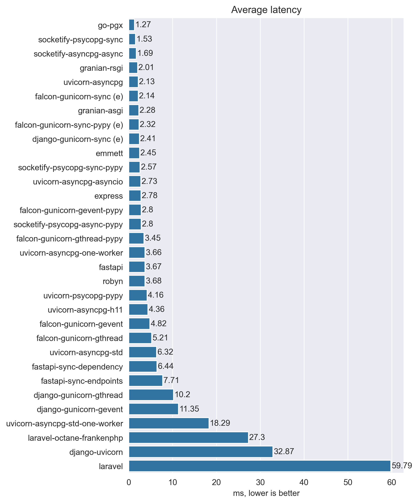
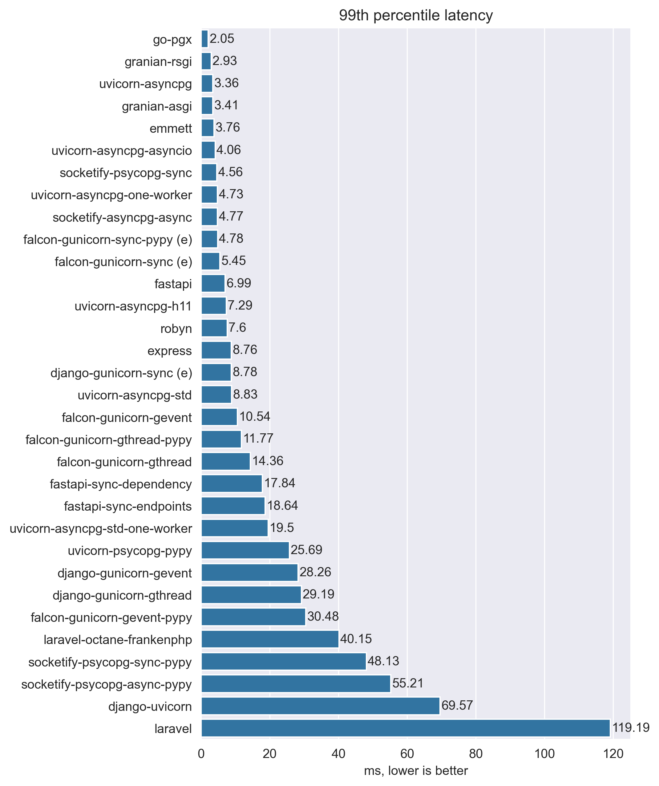
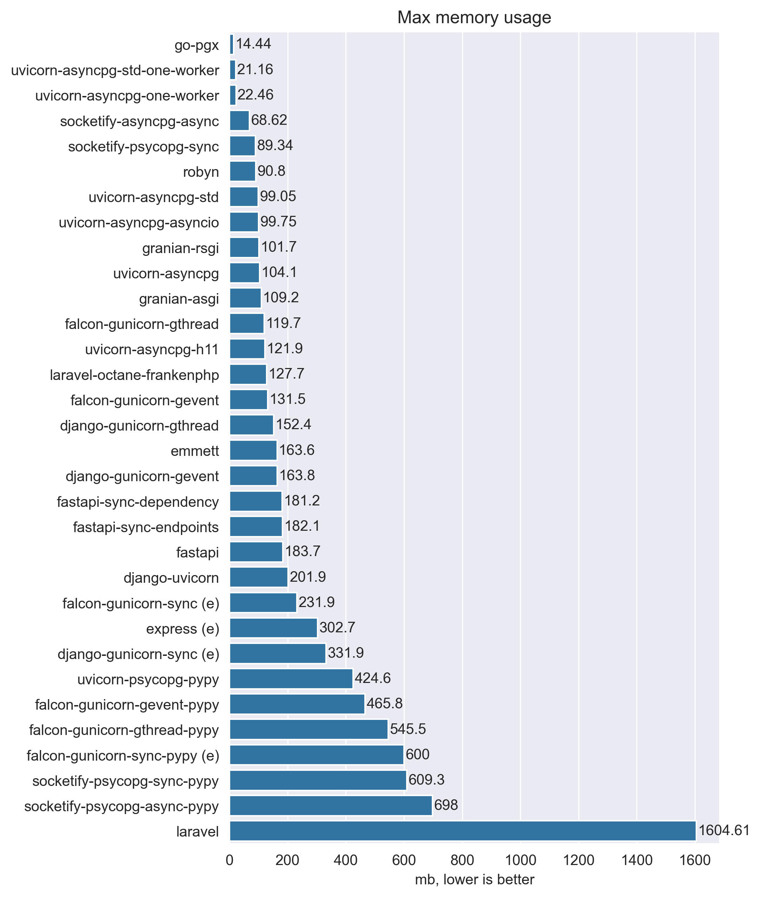
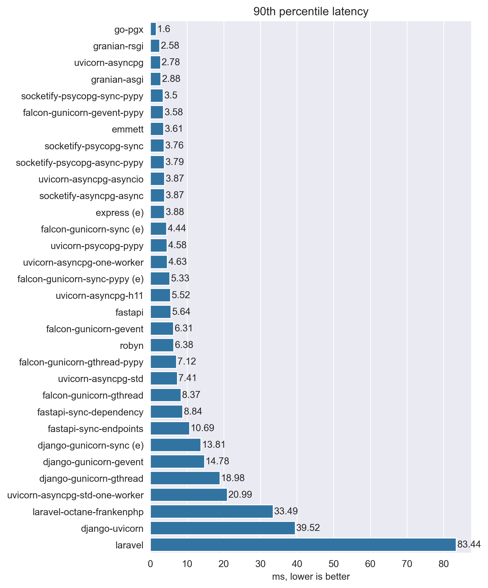

# My Web Frameworks Benchmarks Results

## Disclaimer

Just a simple benchmark to compare the overhead of some web frameworks.
Not representative of real world usage,
don't take it too seriously and always do your own benchmarks.

## Methodology

For benchmarking I used laptop with Intel Core i5-7300hq for running web frameworks and
MacBook Air M1 for running wrk.

Frameworks not limited by RAM or CPU, if framework can use multiple threads
I set it to use all available threads (4 in case of my laptop).

To collect cpu and memory usage I used `monitor.sh` script that just dumps docker stats to a file.

wrk was run with 8 threads, because it's the number of threads that my MacBook Air M1 has.
Connections number is 64. While running wrk CPU usage was never at 100%, so wrk was not a bottleneck.

## Results

Participants:

- go-stdlib: Go stdlib http server, no dependencies, only stdlib.
- uvicorn: ASGI server, uses `uvloop` and `httptools` for parsing requests and `orjson` for json serialization.
- uvicorn-one-worker: same as uvicorn, but with only one worker.
- uvicorn-h11: same as uvicorn, but uses `h11` for http.
- uvicorn-asyncio: same as uvicorn, but uses stdlib asyncio loop.
- uvicorn-stdlib: uvicorn with stdlib asyncio loop, h11 and stdlib json serialization.
- uvicorn-stdlib-one-worker: same as uvicorn-stdlib, but with only one worker.

### Plaintext

Just a simple plaintext response. Dont't expect too much from it,
not representative of real world usage, just a simple overhead comparison.

### API

"Api" workload - parse query parameter, header and return them in json response.
Again, not representative of real world usage, just a simple overhead comparison of
framework validation and json serialization.

