# My Web Frameworks Benchmarks Results

## Disclaimer

Just a simple benchmark to compare the overhead of some web frameworks.
Not representative of real world usage,
don't take it too seriously and always do your own benchmarks.

## Methodology

For benchmarking I used laptop with Intel Core i5-7300hq and 24GB RAM for running
web frameworks and MacBook Air M1 with 16GB RAM for running wrk.

Machines were connected via 1Gbps ethernet cable.
Throughput checked with `iperf3` was around 940Mbps.

<details>
    <summary>iperf3 results</summary>

```
[nix-shell:~/web_benchmarks]$ iperf -c 192.168.99.1
Connecting to host 192.168.99.1, port 5201
[  5] local 192.168.99.2 port 63217 connected to 192.168.99.1 port 5201
[ ID] Interval           Transfer     Bitrate
[  5]   0.00-1.01   sec   115 MBytes   958 Mbits/sec
[  5]   1.01-2.00   sec   114 MBytes   956 Mbits/sec
[  5]   2.00-3.00   sec   111 MBytes   936 Mbits/sec
[  5]   3.00-4.01   sec   113 MBytes   947 Mbits/sec
[  5]   4.01-5.00   sec   111 MBytes   937 Mbits/sec
[  5]   5.00-6.00   sec   113 MBytes   946 Mbits/sec
[  5]   6.00-7.00   sec   112 MBytes   939 Mbits/sec
[  5]   7.00-8.01   sec   110 MBytes   926 Mbits/sec
[  5]   8.01-9.00   sec   114 MBytes   959 Mbits/sec
[  5]   9.00-10.01  sec   111 MBytes   932 Mbits/sec
- - - - - - - - - - - - - - - - - - - - - - - - -
[ ID] Interval           Transfer     Bitrate
[  5]   0.00-10.01  sec  1.10 GBytes   944 Mbits/sec                  sender
[  5]   0.00-10.01  sec  1.10 GBytes   941 Mbits/sec                  receiver

iperf Done.
```
</details>

Frameworks not limited by RAM or CPU, if framework can use multiple threads
I set it to use all available threads (4 in case of my laptop).

To collect cpu and memory usage I used `monitor.sh` script that just dumps docker stats to a file.

wrk was run with 8 threads, because it's the number of threads that my MacBook Air M1 has.
Connections number is 64. While running wrk CPU usage was never at 100%, so wrk was not a bottleneck.

## Results

Participants:

- go-stdlib: Go stdlib http server, no dependencies, only stdlib.
- uvicorn: ASGI server, uses `uvloop` and `httptools` for parsing requests and `orjson` for json serialization.
- uvicorn-one-worker: same as uvicorn, but with only one worker.
- uvicorn-h11: same as uvicorn, but uses `h11` for http.
- uvicorn-asyncio: same as uvicorn, but uses stdlib asyncio loop.
- uvicorn-stdlib: uvicorn with stdlib asyncio loop, h11 and stdlib json serialization.
- uvicorn-stdlib-one-worker: same as uvicorn-stdlib, but with only one worker.

### Plaintext

Just a simple plaintext response. Dont't expect too much from it,
not representative of real world usage, just a simple overhead comparison.


<details>
    <summary>CPU median</summary>


</details>


<details>
    <summary>Memory max</summary>


</details>


<details>
    <summary>Latency max</summary>


</details>

<details>
    <summary>Latency 90th</summary>


</details>

<details>
    <summary>Latency 99th</summary>


</details>


### API

"Api" workload - parse query parameter, header and return them in json response.
Again, not representative of real world usage, just a simple overhead comparison of
framework validation and json serialization.


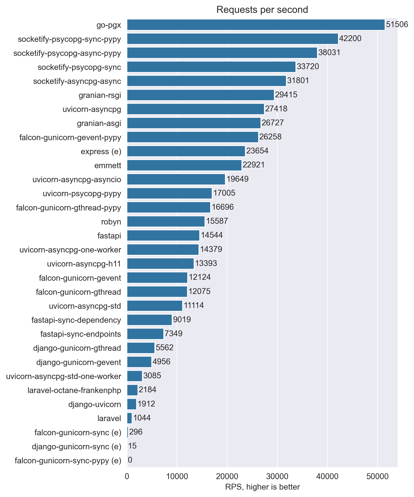


<details>
    <summary>CPU median</summary>


</details>

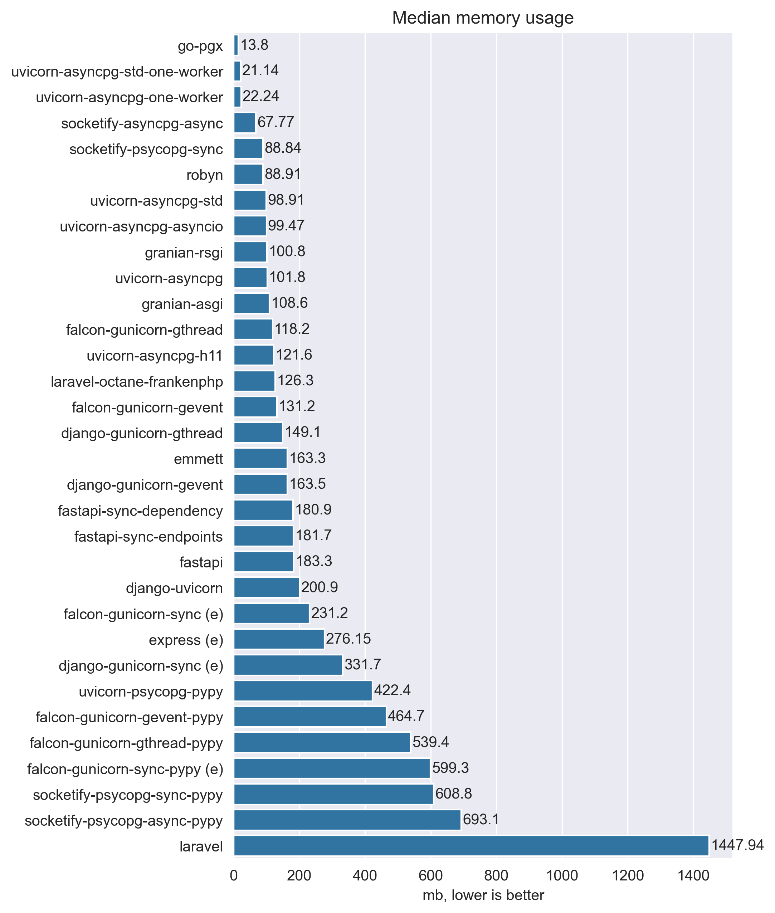

<details>
    <summary>Memory max</summary>


</details>


<details>
    <summary>Latency max</summary>

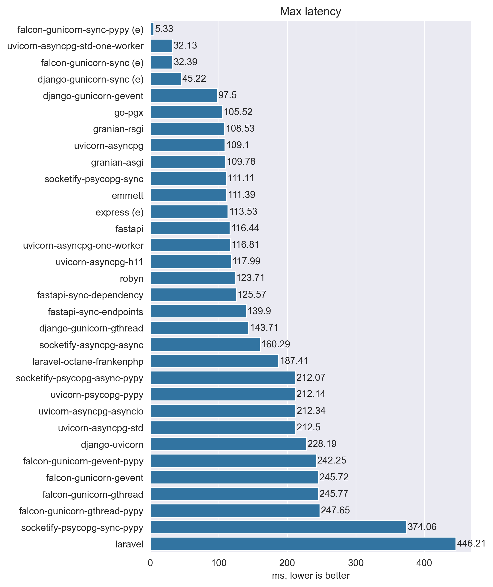
</details>

<details>
    <summary>Latency 90th</summary>


</details>

<details>
    <summary>Latency 99th</summary>

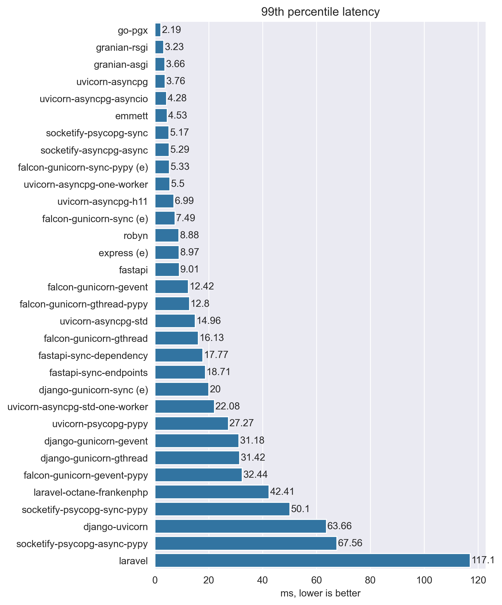
</details>


### Database

Database workload - this is more representative of real world usage.
One query to select 1 row by id and another query to select 100 rows.
All data retrieved from database instantiated as some structure
(for example - dataclasses in Python and Struct in Go) and then serialized to json.


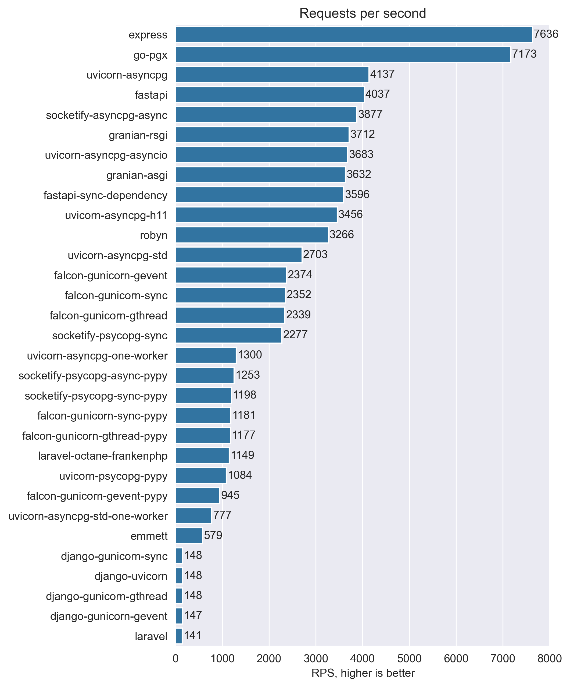
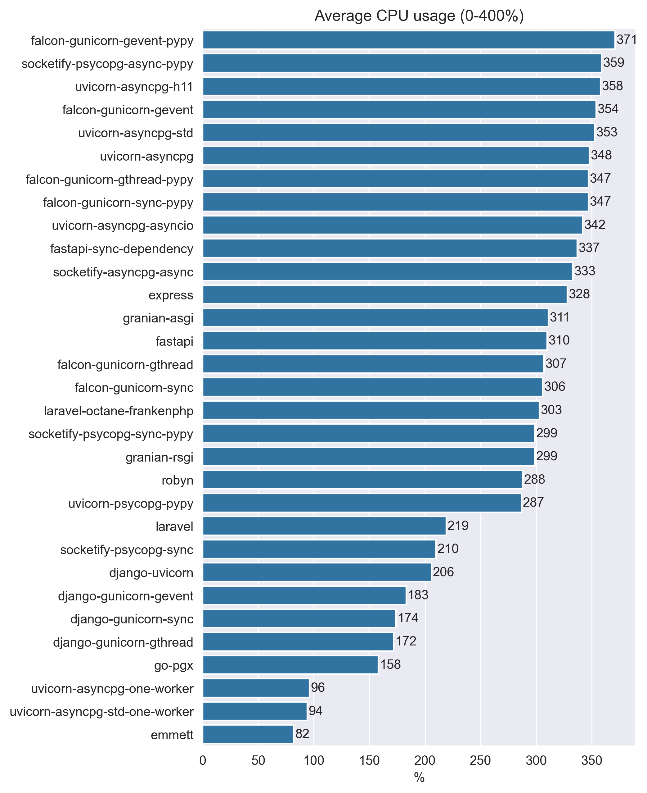

<details>
    <summary>CPU median</summary>


</details>

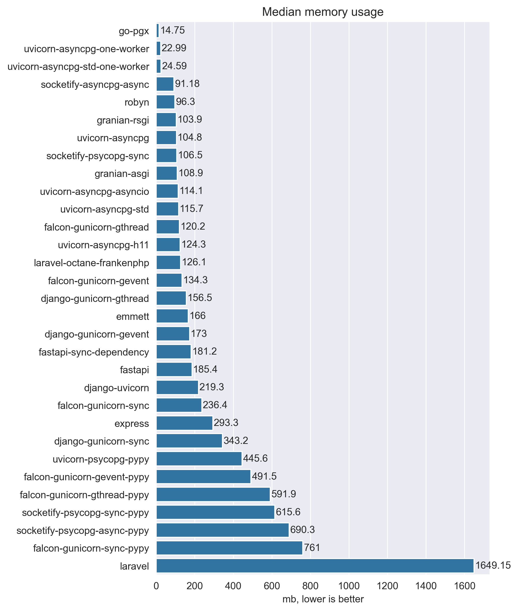

<details>
    <summary>Memory max</summary>


</details>

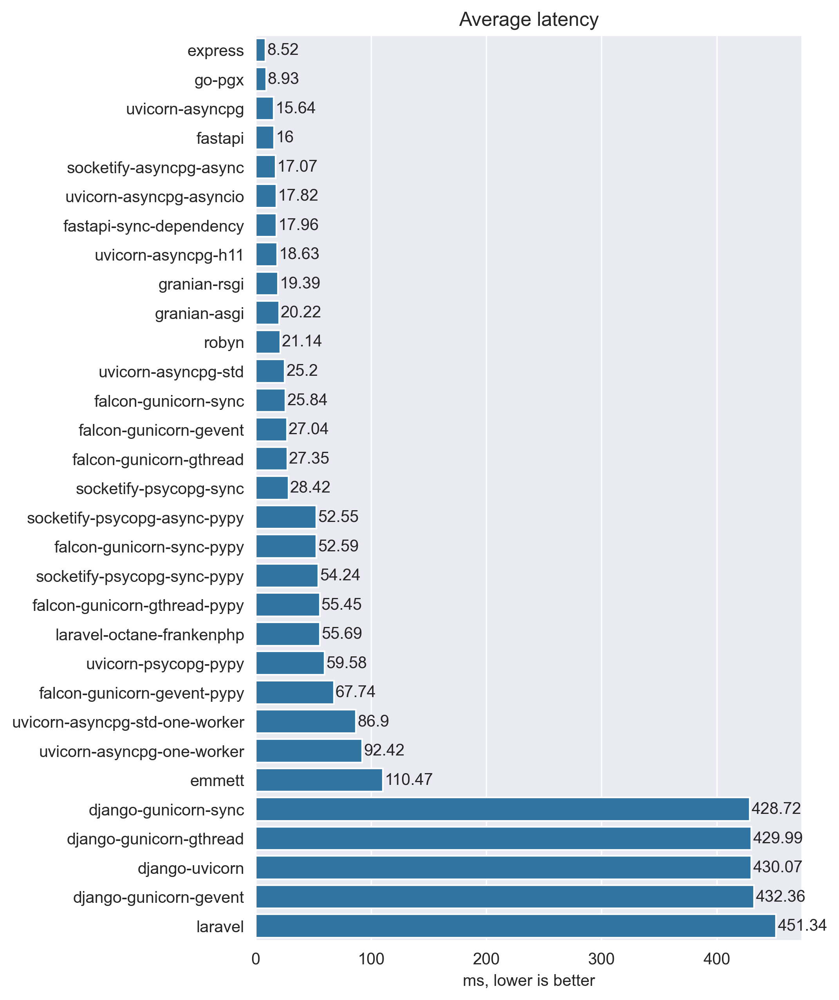

<details>
    <summary>Latency max</summary>

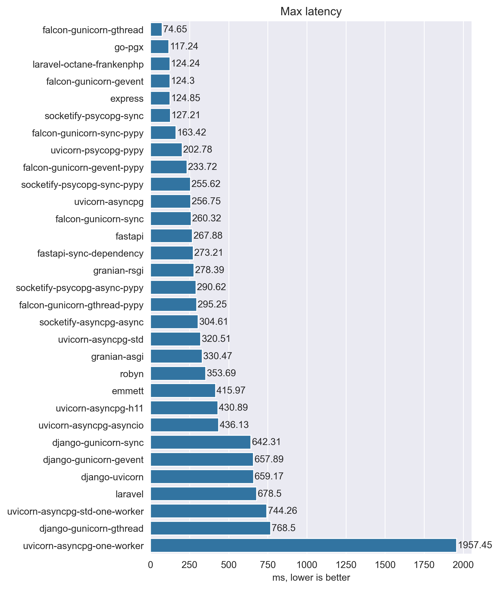
</details>

<details>
    <summary>Latency 90th</summary>

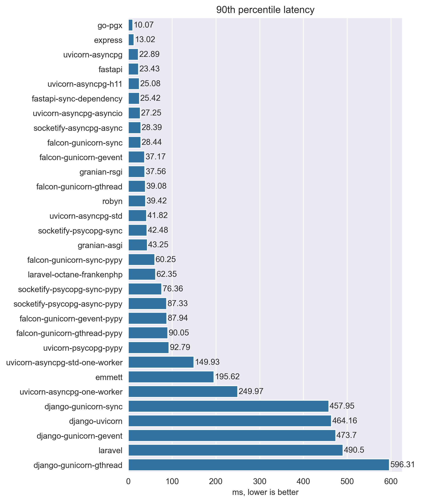
</details>

<details>
    <summary>Latency 99th</summary>

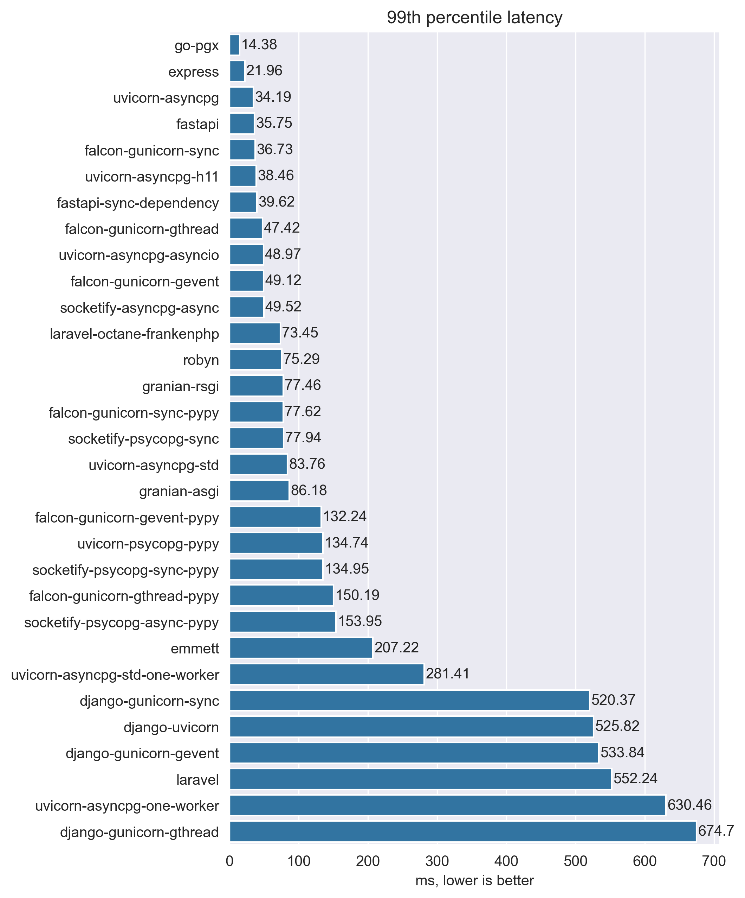
</details>
